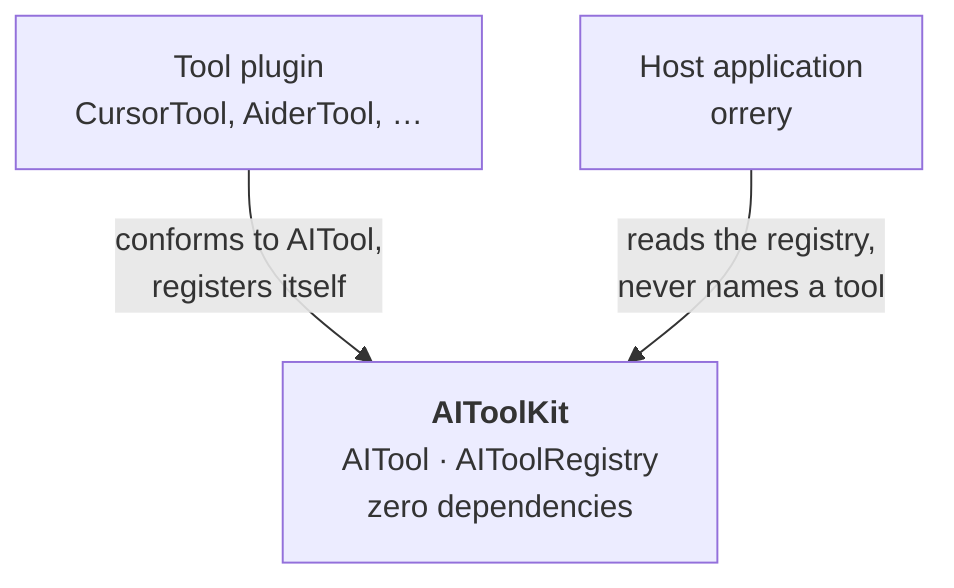
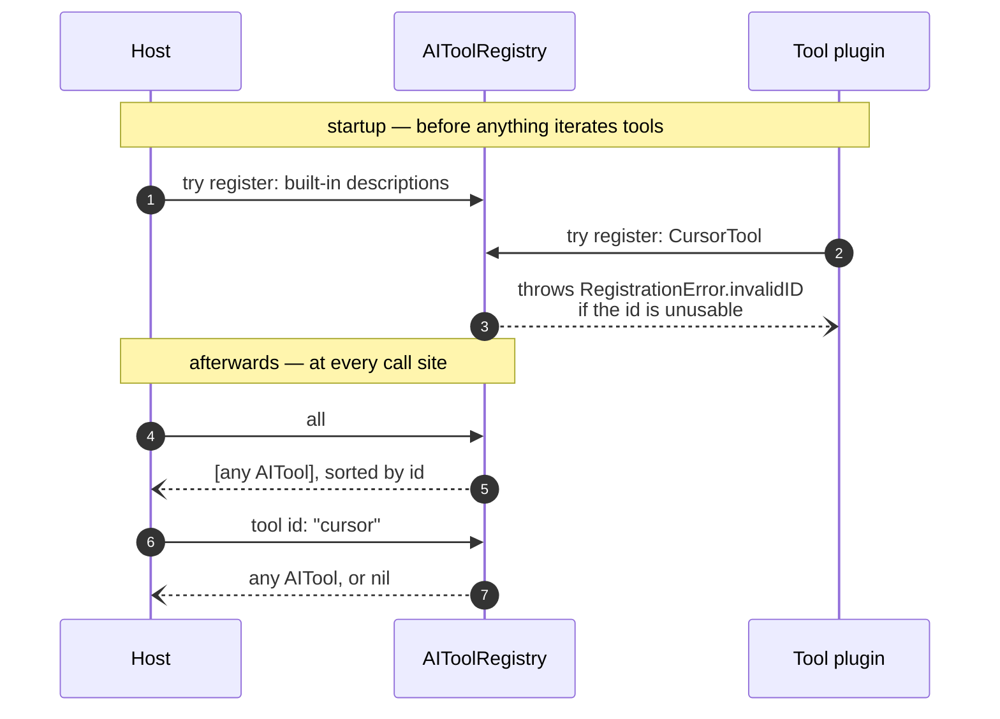
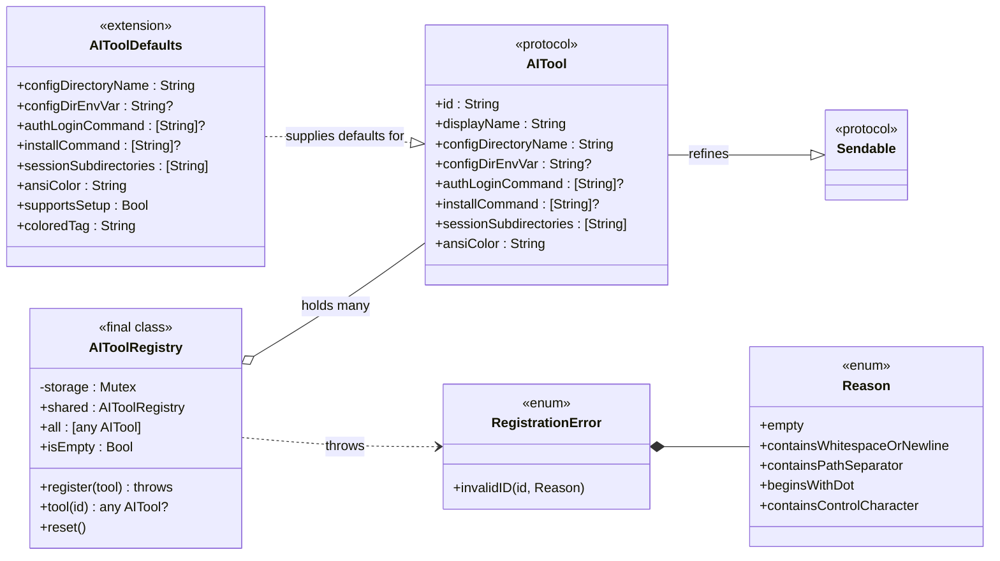
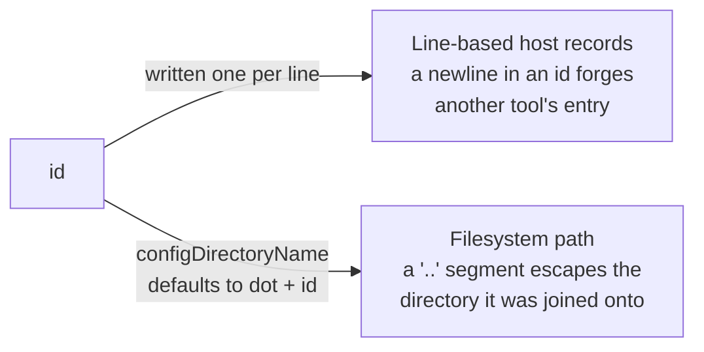
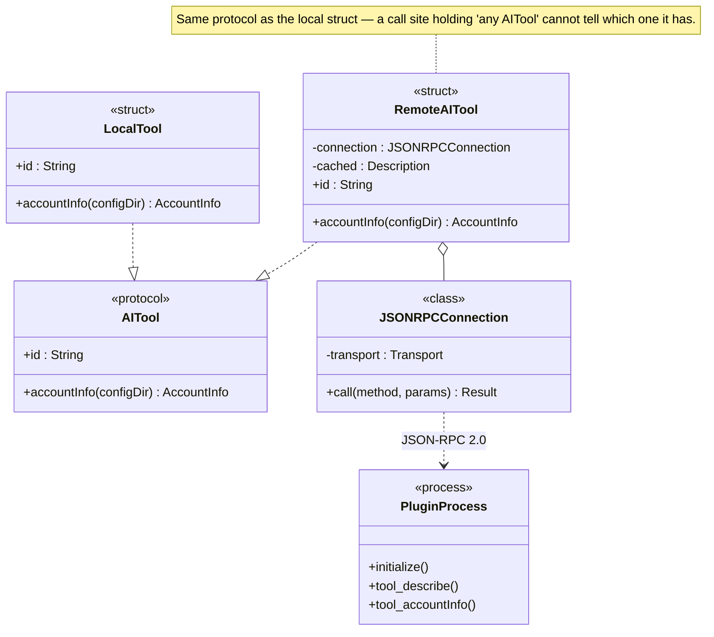
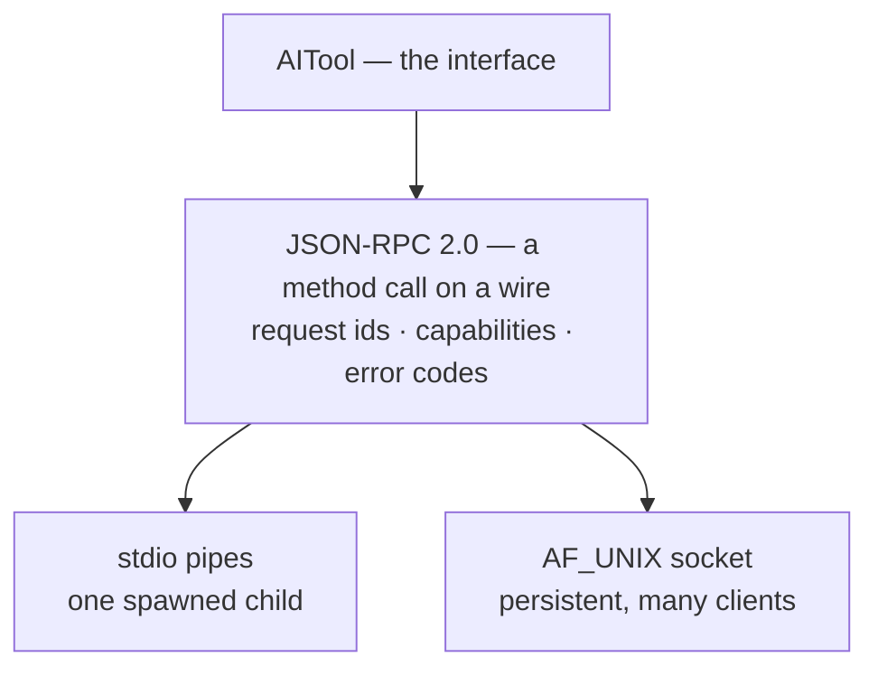
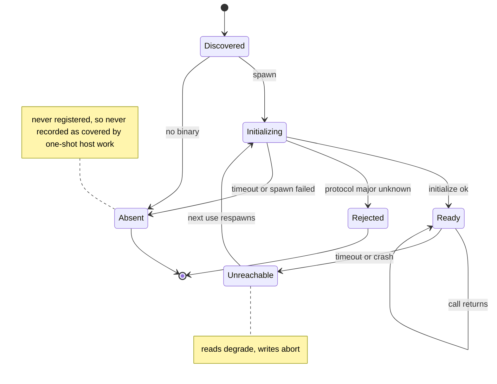
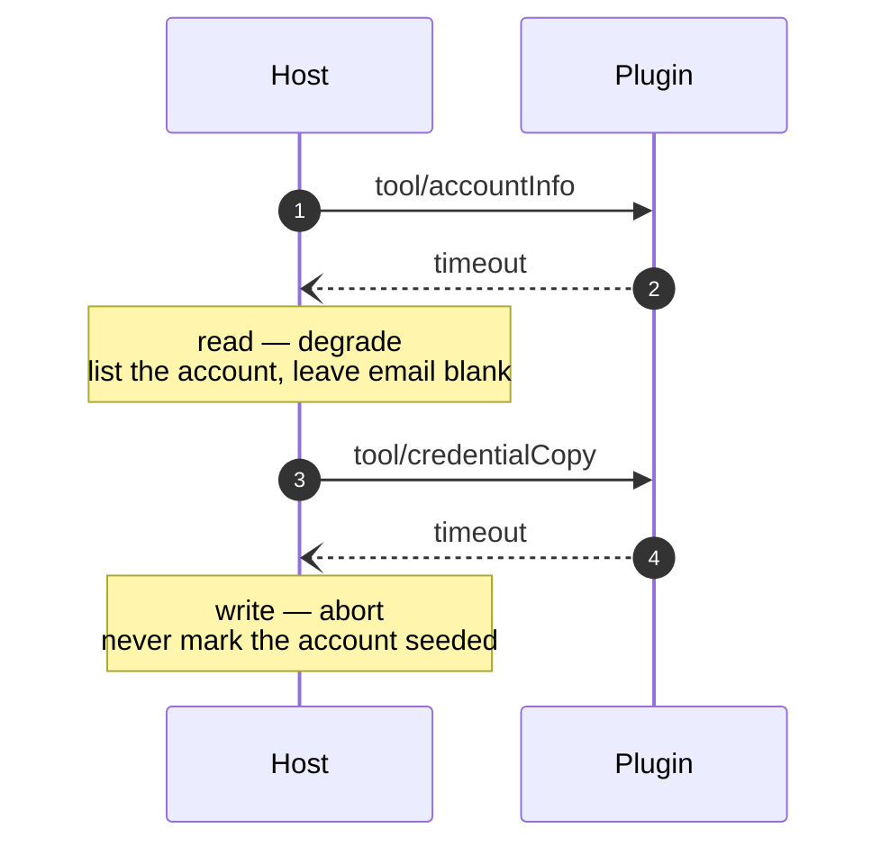
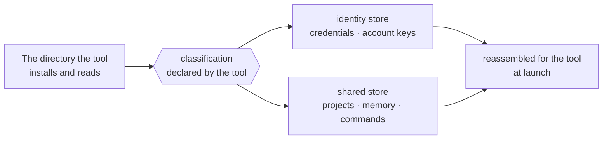

# AIToolKit

Describes an AI CLI tool — how to launch it, where its config lives, how it
logs in — so a host application can manage several of them without knowing
any of them by name.

Built for [orrery](https://github.com/OffskyLab/Orrery), but deliberately
independent of it: a tool plugin depends on this package alone, never on
orrery itself.

**Status: 0.x.** The interface is expected to change while orrery's own
migration onto it is in progress. Semver applies from 1.0.

## Why a separate package

The dependency that matters here is the one that is missing. A plugin points at
this package and stops; it never links the host, so adding a tool never means
patching the host or waiting for the host to release.



The gap along the top is the design. Both sides depend on the package and
neither depends on the other, so the host gains a tool it was never compiled
against, and the plugin ships without a copy of the host's release schedule.

## Registration and lookup

Nothing resolves a tool by name. The host populates the registry once at
startup, plugins add themselves, and every later call site asks the registry —
which is why a tool the host has never heard of behaves like one it ships.



Ordering is the one rule: register before anything reads the registry. A host
that iterates tools to do one-shot work will record what it covered, so a tool
registered afterwards is a tool that work silently skipped.

## Type structure



Only `id` and `displayName` have no default, so those two are what a conformer
must answer. `supportsSetup` and `coloredTag` are derived and are not
requirements at all — a detail with teeth, since extension members do not
dispatch dynamically.

## Conforming a tool

`AITool` is a protocol. A conformer answers `id` and `displayName`; everything
else has a default.

```swift
struct CodexTool: AITool {
    let id = "codex"
    let displayName = "Codex CLI"
}
// configDirectoryName == ".codex", configDirEnvVar == nil, installCommand == nil, …

try AIToolRegistry.shared.register(CodexTool())
```

`register` throws when the id is empty, carries whitespace or a newline,
contains a path separator or a control character, or begins with `.`. Each
rejection names the rule it broke, as a `RegistrationError.Reason`.

The id is the one part of a description that leaves the process, and it leaves
in two shapes — which is why the rules are the package's job rather than each
host's:



It is **written into line-based records**: an id of
`"cursor\nclaude"` read back as two lines is how a host silently marks a
*different* tool's one-shot work complete, and a trailing space is written
verbatim and read back trimmed, so it never matches itself. And it is
**path-forming**, because `configDirectoryName` defaults to `".\(id)"` — so
`"a/b"` becomes a nested path where one segment was expected, `"./../evil"`
becomes `"../../evil"` and escapes the home directory it was joined onto, and a
NUL truncates the path at the first POSIX call. The package ships the default
that makes ids path-forming, so the package validates them, rather than leaving
every host to rediscover the rule.

`Sendable` is the only conformance `AITool` refines. `Codable`, `Hashable` and
`Equatable` are deliberately absent: nothing here serializes to a wire format,
and decoding would need a concrete type anyway — recovering one from a stored
id needs an id→type table, which is what `AIToolRegistry` is. A host encodes
the `id` and reads it back with `registry.tool(id:)`.

## Concurrency

Strict Swift 6, no escape hatches: no `@unchecked Sendable`,
`nonisolated(unsafe)` or `@preconcurrency` anywhere. `AIToolRegistry` is plain
`Sendable`, holding its table in a `Mutex` so the compiler verifies the claim
instead of taking the package's word for it. The manifest states
`swiftLanguageModes: [.v6]` rather than inheriting it.

## What belongs here

Facts about a tool. `~/.claude` is where Claude Code keeps its config;
gemini-cli ignores `GEMINI_CONFIG_DIR` and reads only `$HOME/.gemini`.

## What does not

Anything the *host* decides. Account pools, credential storage policy,
directory sharing — those live in the host, because they are its inventions,
not the tool's.

## Dispatch is a detail

The JSON-RPC layer described in this section shipped in `0.0.1-dev.4`: the
transport abstraction, JSON-RPC 2.0 as the wire, and the forwarding proxy that
makes a remote tool indistinguishable from a local one at the call site.

A framework is an architecture of method calls. Whether a call lands in this
process or another one is a dispatch choice, not a change of design — and RPC
is what lets a piece that would otherwise be compiled in ship and run on its
own instead.

That makes the plugin boundary a *process* boundary rather than a link-time
one, which is the difference between "a third party can add a tool" and "a
third party can add a tool without forking the host."

### The proxy is itself an `AITool`

The registry does not change. A remote tool is a conformer that forwards each
call over the wire, so a call site cannot tell — and does not need to.



Two consequences fall out. Built-in and third-party tools take the *same*
path, so shipping a built-in this way is what proves the third-party path
works. And the transport becomes a per-tool, reversible decision: a tool whose
call rate makes a round trip too expensive can be linked in-process instead,
without touching a single call site.

### The wire is JSON-RPC 2.0, so the transport can move

Method calls carry request ids and travel over a stream. Nothing in the
protocol assumes one process per request, so a spawned child today and a
persistent socket tomorrow are the same protocol over different plumbing.



`initialize` negotiates protocol version and declares which optional methods a
plugin implements, so the host never pays a round trip for a capability that
is not there. `-32601 Method not found` is the standard answer for one that
slipped through.

**Request ids are `Int`, not the full JSON-RPC 2.0 id space.** The spec
permits a string id as well as a number, but this package types `id` as
`Int` on the request and `Int?` on the response. A non-Swift plugin author
who echoes the host's id back as `"1"` instead of `1` gets
`JSONRPCError.malformedResponse` with nothing pointing at why. Since this
package is itself the conformance suite a third-party plugin is written
against, that narrowing belongs in writing, not left for an implementer to
discover by trial and error.

**The transport shipped today is a spawned child, not a socket.** Every call
goes through `StdioTransport`: a process spawned, `initialize`d, and used —
the "stdio pipes" box in the diagram above, not the "AF_UNIX socket" one. A
persistent transport is deliberately unbuilt. The protocol permits it — that
is the point of layering JSON-RPC under `AITool` instead of wiring the two
together — but nothing spawns it until a measured workload demands it. A
spawn-initialize-describe round trip measures at roughly 7.6 ms median today,
and that number, not intuition about which tool "feels" hot, is what the
decision to build a socket waits on.

### A plugin's lifecycle, and where it can end up



`Absent` and `Rejected` are terminal for the run and leave every other tool
untouched — one broken plugin must not cost the host its working ones.

The note on the left is the interaction worth stating out loud: a host that
does one-shot per-tool work records what it covered, so a tool absent at that
moment must not be marked done. Recording coverage as a union of tools that
were actually present gets this right for free, and the tool is picked up on a
later run once its plugin is fixed.

### Reads degrade, writes abort

The rule that decides every failure: a missing answer may be rendered as
missing, but an action that may not have happened is never reported as done.



Listing accounts is worth doing with one field missing. Recording a credential
as copied when it may not have been is the failure that looks like success,
and costs someone an account they believe is safe.

A socket earns its place when the peer outlives the caller or serves several
callers at once. Which caller that is should be established by measuring a
real workload, not by reasoning about which one sounds frequent — the obvious
candidate is often not a client at all. Two details bite on macOS: `sun_path`
caps a socket path near 104 bytes, which deep config directories exceed
easily, and the socket's file permissions *are* its access control.

### The price, and why it was already paid

A remotable interface cannot take closures, shared mutable references, or live
handles; every argument and result has to survive serialization.

That is the same constraint as "no host types in the interface", arrived at
from the other side — a host's account store is unremotable precisely because
it is a live object wired to a filesystem. Two independent rules converging on
one line is usually a sign the line is in the right place.

It is also why `AITool` refines `Sendable` alone. A protocol carrying
`Codable` could not be conformed to by a forwarding proxy without contortion;
serialization belongs to a concrete wire type, not to the interface.

## Direction: a tool decomposes its own config directory

> **Not implemented.** This section is design, recorded here so the shipped
> interface can be judged against where it is going. The directory
> classification described below does not exist yet — the dispatch layer
> above it does, as of `0.0.1-dev.4`.

A CLI tool installs one config directory and mixes two different things into
it: who you are, and what you have accumulated. A host that wants one identity
to move between several sets of accumulated state — or several identities to
share one set — has to separate them, and the classification is knowledge
about *that tool*, not about the host.



The classification has three layers, and the third is the one that bites:

- **Whole subdirectories.** Some are per-identity and disposable; some are the
  accumulated state worth sharing.
- **Keys inside a mixed file.** At least one file usually carries identity and
  shared state in the same JSON object, so the split is per-key, not per-file.
- **Unknown keys.** A tool gains fields over time, and a field nobody has
  classified yet must default to *identity* — sharing an unrecognized
  identity-like value across accounts is the failure that is hard to notice
  and hard to undo.

The declaration is data, not an operation. The tool says which paths and keys
belong where; the host decides how to honour it — symlink or copy, atomicity,
what to do on a partial failure — because those are the host's problem and its
existing machinery already solves them.

Two things fall out. When a tool adds a field, the plugin is what needs
updating, not the host, which is the concrete payoff a plugin boundary is
supposed to buy. And "several installations of one tool" stops being a feature
to build: bind a tool to different roots and pair each with an identity, and
that is what you get — without this package ever learning the host's word for
what those roots are.
